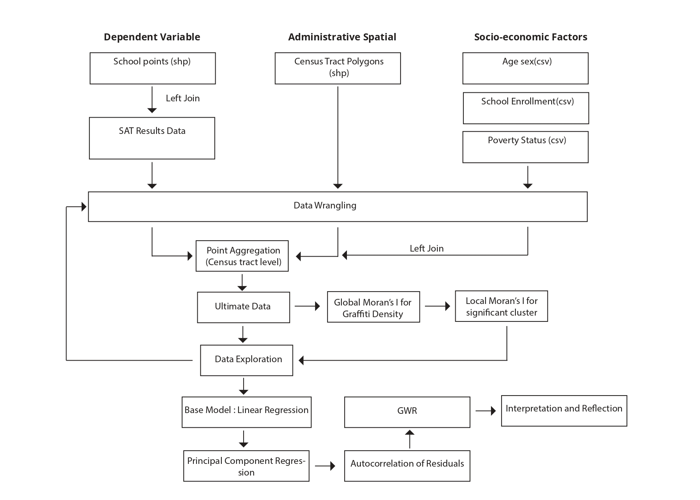

Chicago Student Benchmark Test Trends

1.  Initial Project Scope

2.  Data Loading, Wrangling and Pre-processing

3.  Data Exploration

4.  Analysis

5.  Interpretation of the outputs

6.  Reflection on the outcome

# Initial project scope

The Standardized Tests (SATs) for university admissions are being used
by the City of Chicago to examined the social and geographic
characteristics that have a impact on the proportion of kids who pass
the benchmark exams for college.

For this project, average college readiness percentage for 2020/2021
will be analysed to understand demographic and socioeconomic factors
that contribute to it across Chicago and spatial heterogeneity in the
relationship between those determinants and average college readiness.
Findings will, then, be used to present a case to educational
stakeholders for decision-making and taking action.

#### Research Question:

What are the socioeconomic and demographic factors that contribute to
average college readiness percentage across census tracts in Chicago in
academic year of 2020/2021?

#### Hypothesis:

There is no relationship between demographic and socioeconomic factors
and average college readiness across Chicago in 2020/2021 academic year.

In this project, five different datasets will be used to detect spatial
patterns of average college readiness in Chicago.

-   School Point dataset retrieved from Chicago Data Portal
    (<https://data.cityofchicago.org/Education/Chicago-Public-Schools-School-Admissions-Informati/tiw4-68h5>)

-   Census Track Spatial Data from United States Census Bureau
    (<https://data.sfgov.org/Geographic-Locations-and-Boundaries/Census-2010-Tracts-for-San-Francisco/rarb-5ahf>)

-   Age and sex data retrieved from United States Census Bureau
    (<https://data.census.gov/map?q=population&g=0400000US17$1400000&layer=VT_2020_140_00_PY_D1&mode=thematic&loc=39.7951,-89.6588,z8.0000>)

-   Poverty Status data retrieved from United States Census Bureau
    (<https://data.census.gov/map?g=0400000US17$1400000&tid=ACSST5Y2021.S1701&layer=VT_2021_140_00_PY_D1&mode=thematic&loc=39.7951,-89.6588,z8.0000>
    )

School point dataset is a shapefile format data. Fruitful columns for
this project are school ID and name in context of research question.
There are 861 schools and 23 columns. The CRS is WGS84 for this dataset.
Therefore, it should be transformed into projected coordinate system
(26914) to use it for spatial analysis. The analysis will be census
tract level. Therefore, school data joined with SAT results will be
aggregated to census tracts to understand distribution of average
college readiness across Chicago. This response variable will be used to
make our analysis comparable across census tracts since they will be
average.

Average college readiness is directly or indirectly affected by
demographic and socioeconomic factors. Understanding which factors are
able to explain the this dependent variable is the vital to approach
problem constructively. Therefore, demographics such as total population
and female population percentage, and socioeconomic data such as,
poverty status will be used to enrich the ultimate dataset used in the
analysis.

-   Census tract level will be used in the project and demographic and
    socio-economic datasets are also census tract level. However, school
    data is point data. Aggregation will be conducted to calculate mean
    average college readiness in each census tract.

-   For all datasets, only necessary columns will be selected and names
    of the columns will be transformed into a mnemonic format.

-   Since the coordinate reference systems of two spatial data (census
    tract and schools points) are different, their CRSs will be
    transformed into a projected coordinate system with meter unit.

-   During loading the datasets, NA values will be considered and some
    unnecessary rows will be skipped. More detailed data wrangling
    process will continue in relevant section.

-   There are serious level of missing values in SAT results. These
    schools without SAT results will be eliminated.

In connection to research question, average college readiness percentage
is the variable we are going to explain and predict with demographics
and socioeconomic factors across different census tracts in Chicago.

-   **The dependent variable :** Average college readiness percentage

-   **The independent variables:** Total population, female population
    percentage, population percentage of 15-19, poverty status of people
    under 18

First we join the SAT result dataset with each school and then remove
all schools without college readiness percentage. Since our analysis
will be in census tract level, schools will be aggregated to tracts by
calculating mean college readiness percentage.

In this study, after wrangling the data, average college readiness will
be mapped to understand spatial distribution in census tract level. To
decrease the subjectivity of the map, we are going to use moran's I to
examine if there is a statistically significant clustering in the
dependent variable. After exploring and transforming data in accordence
with the linear regression assumptions, Linear regression will be used
as a baseline model because we assume sort of linearity between
dependent variables and dependent variables. Therefore, those
assumptions will be examined to understand variable's distribution and
multicollinearity. After the model, independence of errors will be
examined. If there is spatial autocorrelation between residuals between
tracts, then spatial regression models will be used. If so, results will
be compared and local coefficients will be mapped to understand their
spatial distribution for each variable.

**Overall Workflow of the project**

```{r pressure, echo=FALSE, fig.cap="Overall Workflow of the project", out.width = '100%'}

```

**Assumptions**

-   We accept that all schools were collected in correct location. The
    point near borders may fall in wrong census tract, which will affect
    our results.

-   Census tract level analysis is appropriate enough to derive spatial
    solutions for decision-makers and other stakeholders

-   Linearity between dependent and independent variables for regression
    models

-   There is no multicollinearity between independent variables ( will
    be checked with VIF)

-   Eliminating too many missing values are okay

-   Other assumptions will be made after the regression model
    (independence of errors)

## 2. Data Loading, Wrangling and Pre-processing

In this section, relevant datasets will be loaded and necessary
pre-processing will be made to have a clear, accurate and reproducible
datasets that can be easily used in the analysis process.

### 2.1. Loading datasets

```{r}

#loading necessary libraries for this project

library(readxl) #for impoorting excel files
library(sf) #library for spatial objects
library(here) #library for finding the data in the relevant directory
library(tidyverse) #library for modifying columns and adding new ones
library(tmap) #library for plotting and mapping
library(tmaptools) #library for plotting and mapping
library(janitor) #library for rearranging the columns of the dataset
library(ggplot2) #library for data visualisation
library(units) #library for new units, class and numeric data 
library(reshape2) #library for transforming the data
library(car) #library for regression methods
library(broom) #library for tidying statistical models
library(spdep) #library for spatial dependence
library(spgwr) #library for geographically weighted regression
library(caret) #library for cross-validation, etc.
library(vip) #library for creating feature importance graphs
library(spatialreg) #library for spatial lag and error models


```

#### #2.1.1. Importing School Data

-   School Point dataset retrieved from Chicago Data Portal
    (<https://data.cityofchicago.org/Education/Chicago-Public-Schools-School-Admissions-Informati/tiw4-68h5>)

```{r}

#importing the census tract shapefile without any wrangling

schools <- st_read(here::here("data",
                              "Chicago Public Schools - School Admissions Information SY2021", 
                                "geo_export_3491326f-243d-4b67-bb87-9f050064a0e6.shp"))
```

#### #2.1.2. Importing Census Track Data

This data is a shapefile (shp) consisting of census tracts retrieved
from
<https://www.census.gov/geographies/mapping-files/time-series/geo/cartographic-boundary.html>

This data has lots of columns, most of which is not useful for our
analysis.

```{r}

#importing the census tract shapefile without any wrangling

census_tract <- st_read(here::here("data", 
                                    "cb_2021_17_tract_500k", 
                                "cb_2021_17_tract_500k.shp")) %>%
  
  #selecting only tracts within Cook County
    dplyr::filter(NAMELSADCO == "Cook County")
                          
```

```{r}
#basic mapping to check everthing is okay so far

tmap_mode("plot")
tm_shape(census_tract) +
  tm_polygons(col = "grey", alpha = 0.5)
```

#### #2.1.3. SAT Exam Results

The excel spreadsheet that contain SAT exam results retrieved from
<https://www.cps.edu/about/district-data/metrics/assessment-reports/>

```{r}

sat_result <- read_excel(here::here("data", 
                                    "assessment_psatsat_schoollevel_2022.xlsx"), sheet = "Adjusted Data")
```

#### #2.1.4 Age and Sex Data

Age and sex data retrieved from United States Census Bureau
(<https://data.census.gov/map?q=population&g=0400000US17$1400000&layer=VT_2020_140_00_PY_D1&mode=thematic&loc=39.7951,-89.6588,z8.0000>)

```{r}


#importing the csv file and dealing with missing values 

pop <-read.csv(here::here("data",
                             "ACSST5Y2021.S0101_2022-12-16T052424",
                             "ACSST5Y2021.S0101-Data.csv"), 
                  na = c("-","N","null"),
                  header=T,
                  sep=",")[-1,]


```

#### #2.1.5 Poverty Status Data

-   Poverty Status data retrieved from United States Census Bureau
    <https://data.census.gov/map?g=0400000US17$1400000&tid=ACSST5Y2021.S1701&layer=VT_2021_140_00_PY_D1&mode=thematic&loc=39.7951,-89.6588,z8.0000>

```{r}


#importing the csv file and dealing with missing values 

poverty <-read.csv(here::here("data",
                             "ACSST5Y2021.S1701_2022-12-16T053537",
                             "ACSST5Y2021.S1701-Data.csv"), 
                  na = c("-","N","null"),
                  header=T,
                  sep=",")[-1,]

```

### 2.2. Data Wrangling and Pre-processing

We already started to deal with our data during importing stage. In this
section, more detailed data wrangling process will be done including
deleting the missing values to prevent them from obstructing the
analysis and filtering out the irrelevant columns to eliminate data
redundancy.

#### 2.2.1. School Point Data Wrangling

**Summary of School Point Data**

```{r}

summary(schools)

```

After converting the csv data into point data, there are 861 schools.
Moreover, we have some unnecessary columns that we can remove.

**Deriving Required Columns from School Data**

```{r}

schools2 <- schools %>%
  
  #selecting necessary columns
  
    dplyr::select(c("school_id",
                  "long_name",
                  "geometry"
                  )) %>%
  
    #cleaning columns (lowercase and without space)

    clean_names()
  
  
```

#### 2.2.2. Age Sex Data Wrangling

```{r}

  #selecting necessary columns

pop2 <- pop %>%
  dplyr::select(c("S0101_C01_001E",
                  "GEO_ID",
                  "S0101_C01_005E",
                  "S0101_C05_001E",
                  )) %>%
  
  
  #renaming some columns
  
  rename(
    total_pop = S0101_C01_001E,
    fema_pop = S0101_C05_001E,
    pop15_19 =S0101_C01_005E,
    AFFGEOID = GEO_ID
    
    )

#converting character columns into numeric

pop2$total_pop = as.numeric(pop2$total_pop)
pop2$fema_pop = as.numeric(pop2$fema_pop)
pop2$pop15_19 = as.numeric(pop2$pop15_19)
pop2$fema_per = (pop2$fema_pop / pop2$total_pop)*100

pop2$pop15_19_per = (pop2$pop15_19 / pop2$total_pop)*100
  

```

#### 2.2.3. Poverty Data Wrangling

```{r}

  #selecting necessary columns

poverty2 <- poverty %>%
  dplyr::select(c("S1701_C01_001E",
                  "GEO_ID",
                  "S1701_C01_002E"
                  )) %>%
  
  
  #renaming some columns
  
  rename(
    total_poverty = S1701_C01_001E,
    under18_poverty = S1701_C01_002E,
    AFFGEOID = GEO_ID
    
    )

#converting character columns into numeric

poverty2$total_poverty = as.numeric(poverty2$total_poverty)
poverty2$under18_poverty = as.numeric(poverty2$under18_poverty)


pop2$under18_poverty_per = (poverty2$under18_poverty / poverty2$total_poverty)*100
  

```

#### 2.2.4. SAT Result Data Wrangling

```{r}

#selecting necessary columns

sat_result2 <- sat_result %>% 
  dplyr::select(c("School Year", 
                  "School ID",
                  "# Students", 
                  "% Meeting College Readiness Benchmark")) %>%
  
  #clean names
  clean_names() %>%
  
    rename( readiness_percent = percent_meeting_college_readiness_benchmark

    ) %>%
  
  
  #select only 2020/2021 year
  
  dplyr::filter(str_detect(school_year, "2020-2021"))


```

**Tranforming the coordinate systems** Census tract is NAD83 and school
point is WGS84. Operations ranging from spatial subsetting to
aggregation require the two spatial dataset to have the same CRS and it
should be projected to use it in spatial analysis. UTM with 26914 code
will be used.

```{r}

#transforming our coordinate system of spatial data into the same projected coordinate system

census_tract <- census_tract %>%
  
  st_transform(., 26914)

schools2 <- schools2%>%
  
  st_transform(., 26914)


```

**Plot Census Data with points**

```{r}

#basic mapping to check everthing is okay so far

tmap_mode("plot")
tm_shape(census_tract) +
  tm_polygons(col = "grey", alpha = 0.5) +
tm_shape(schools2) +
  tm_dots(col = "brown")

  
```

Let's have only census tracts with school point data

```{r}


#spatial subsetting

census_tract_sub <- census_tract[schools2,]

```

```{r}

#basic mapping to check everthing is okay so far

tmap_mode("plot")
tm_shape(census_tract_sub) +
  tm_polygons(col = "grey", alpha = 0.5) +
tm_shape(schools2) +
  tm_dots(col = "brown")

  
```

Join school point data with SAT results

```{r}

#joining schools with SAT results

schools2_join <- schools2 %>%
  left_join(., 
            sat_result2)


```

```{r}
summary(schools2_join)
```

Remove all schools without college readiness percentage

```{r}

#removing missing values

schools3 <-schools2_join %>% 
  drop_na()


```

#### 2.2.5. Aggregation of Schools Data to Census Tracts

Let's aggregate school points to census tracts since census tract level
analysis will be conducted and calculate average college readiness
percentage is required to be calculated according to the research
question.

```{r}

#point aggregation

schools_agg <- schools3%>%
  st_join(census_tract_sub,.)

#calculate the mean of readiness for each tract

schools_agg1 <- schools_agg %>%

  group_by(., AFFGEOID, NAMELSAD)%>%
  summarise(`average_readiness` = mean(readiness_percent))


```

```{r}

# dropping the missing values and zeros

schools_agg2 <- schools_agg1 %>%
  
  dplyr::filter(average_readiness !=0)
```

```{r}

#basic mapping to check everthing is okay so far

tmap_mode("plot")
tm_shape(schools_agg2) +
  tm_polygons(col = "grey", alpha = 0.5)

  
```

Final step to have our dataset that can be used in data exploration by
joining our aggregated data with demographic and socioeconomic data

```{r}

#joining aggregated data with socio-economic data

join <-schools_agg2 %>%
    left_join(., 
            poverty2)

join1 <- join%>%
  left_join(., 
            pop2)


```

## 3. Data Exploration

An effective technique to gain a deeper understanding of the data is to
visualisation that reveals the patterns under the hood. In this study,
it is relevant to create histograms and visualising the geographic
characteristics of data.

#### 3.1. Distribution of the dependent variable : Average College Readiness

The spatial pattern of the data can be more directly extracted by
mapping the variables.

```{r}

#mapping the average college percentage distribution

tm_shape(join1) +
  tm_fill("average_readiness",style="jenks", n= 5, palette = "YlGnBu")  +
  tm_borders(alpha = 0.2) +
  tm_layout(" Map1: Average College Readiness Distribution",
  frame = FALSE,
  legend.title.size=0.6,
  legend.text.size = 0.6,
  legend.position = c("right","bottom")) +
  tm_scale_bar(position = c("left", "bottom")) +
  tm_compass(type = "arrow", position = c("right", "top"))

```

As it can be seen from the map, average college readiness seems very
random but somewhat higher in the northern parts of the city.

#### 3.2. Global Moran's I for Average College Readiness percentage

This method examines if there is any global spatial relationship between
average readiness across census tracts. The first we need to
conceptualize the neighborhood of our spatial features. In this study,
k-nearest will be used because we exclude some census tracts.Indeed, we
have a few data and no contiguity at all. Therefore, there are some
missing spaces in our spatial dataset. Furthermore, we think that rather
than taking contiguity account, finding the nearest neighbours is more
appropriate for this study since social problems such as SAT results are
not limited to borders.

**Hypothesis:** Complete spatial randomness in average college readines
across census tracts

```{r}

#calculate the centroids of all tracts in San Francisco

coordsW <- join1%>%
  st_centroid()%>%
  st_geometry()


#find four nearest neighbours
knn_tracts <-coordsW %>%
  knearneigh(., k=15)

knn_tracts2 <- knn_tracts %>%
  knn2nb()

knn_tracts3_weight <- knn_tracts2 %>%
  nb2listw(., style="W")

moran.test(join1$average_readiness, knn_tracts3_weight)
```

Even though, we use 15 neighbours since we don't have enough data.
Still, Moran's coefficient is 0.089, which is close to randomness but we
have small p-value. We can reject the null hypothesis. It is not very
good idea to continue with Local clustering but let's just see if we are
going to have any significant clustering.

#### 3.3. Local Moran's I

Positive and significant Global Moran's I does not mean clustering of
high of low. We just know like-wise values tend to cluster. We dont not
know the clusters or why they occur. Therefore, it is essential to
perform Local Moran's I to where these clusters occurs. This helps us to
decrease subjectivity of the spatial distribution map of average college
readiness percentage that we created.

```{r}


join1_sp <- as_Spatial(join1)

local_moran_density <- localmoran(join1_sp$average_readiness, knn_tracts3_weight)


# rescale

join1_sp$average_readiness_scale <- scale(join1_sp$average_readiness)


# create a spatial lag variable 

join1_sp$lag_scale_readiness <- lag.listw(knn_tracts3_weight, join1_sp$average_readiness_scale)

# convert to sf
join1_sf<- st_as_sf(join1_sp)


# set a significance value
sig_level <- 0.1

# classification with significance value
join1_sp$quad_sig <- ifelse(join1_sp$lag_scale_readiness> 0 & 
                                          join1_sp$average_readiness_scale> 0 & 
                                          local_moran_density[,5] <= sig_level, 
                                          'high-high', 
                                   ifelse(join1_sp$lag_scale_readiness <= 0 & 
                                          join1_sp$average_readiness_scale <= 0 & 
                                          local_moran_density[,5] <= sig_level, 
                                          'low-low', 
                                   ifelse(join1_sp$lag_scale_readiness > 0 & 
                                          join1_sp$average_readiness_scale <= 0 & 
                                          local_moran_density[,5] <= sig_level, 
                                          'high-low', 
                                   ifelse(join1_sp$lag_scale_readiness <= 0 & 
                                          join1_sp$average_readiness_scale> 0 & 
                                          local_moran_density[,5] <= sig_level, 
                                          'low-high',
                                   ifelse(local_moran_density[,5] > sig_level, 
                                          'not-significant', 
                                          'not-significant')))))


```

```{r}

# map only the statistically significant results here
tm_shape(join1_sp) +
    tm_fill(col = 'quad_sig', palette = c("#de2d26", "#fee0d2", "white"),title= "Clusters") +
    tm_borders(col = "grey")+
  tm_compass(north=0, position=c(0.85,0.80))+
  tm_scale_bar(position = c("left", "bottom")) +
tm_layout("Map2: Significant Clusters Across San Francisco",frame = FALSE,legend.position = c("left","bottom"), legend.title.size = 0.5, legend.text.size = 0.5)


```

Similar to our first map, we do have sort of significant clustering of
high average readiness percent surrounded by high values in the north.
Keep in mind we use very large number of k-nearest number.

#### 3.4. Plot the distribution of the variables

It is essential to create histograms to check the data distribution
since a highly skewed distributed variables will have a impact on the
significance of the model.

It is also the first assumption for linear regression model is a linear
relationship between the predictors and the dependent variable.
Non-linear relationships can also be used after transforming variables.
Therefore, understanding the distributions is vital.

```{r}

#create a histogram of the dependent variable

hist_density<- ggplot(join1, aes(x=average_readiness)) + 
  geom_histogram(binwidth = 5, color = "white",fill="brown")

hist_density

```

Clearly, the dependent variable is not normally distributed. Log
transformation can be applied to have more normally distributed version.

```{r}

#create a histogram of the independent variable

hist_density<- ggplot(join1, aes(x=total_pop)) + 
  geom_histogram(binwidth = 500, color = "white",fill="orange")

hist_density

```

It is not normally distributed as well.

```{r}

#create a histogram of the independent variable

hist_density<- ggplot(join1, aes(x=fema_per)) + 
  geom_histogram(binwidth = 3, color = "white",fill="purple")

hist_density

```

We cannot quite conclude from the graph that female percantage is
normally distributed. Therefore, let's perform shapiro-wilk test

Sometimes, Inferring something from the histrogram can be subjective. We
can use Shapiro-Wilk test.

Hypothesis: The variable is normally distributed.

```{r}

shapiro.test(join1$fema_per)

```

We accept the null hypothesis since p-value is greater than to 0.05. It
is normally distributed.

```{r}

#create a histogram of the independent variable

hist_density<- ggplot(join1, aes(x=pop15_19_per)) + 
  geom_histogram(binwidth = 1, color = "white",fill="purple")

hist_density

```

Again, not clear. Therefore, let's perform shapiro-wilk test

Hypothesis: The variable is normally distributed.

```{r}

shapiro.test(join1$pop15_19_per)

```

We accept the null hypothesis since p-value is greater than to 0.05. It
is normally distributed.

```{r}

#create a histogram of the independent variable

hist_density<- ggplot(join1, aes(x=total_poverty)) + 
  geom_histogram(binwidth = 500, color = "white",fill="purple")

hist_density

```

It is not normally distributed.

```{r}

#create a histogram of the independent variable

hist_density<- ggplot(join1, aes(x=total_poverty)) + 
  geom_histogram(binwidth = 500, color = "white",fill="purple")

hist_density

```

```{r}

#create a histogram of the independent variable

hist_density<- ggplot(join1, aes(x=under18_poverty)) + 
  geom_histogram(binwidth = 100, color = "white",fill="purple")

hist_density

```

It is also not normally distributed.

**Applying log transformation**

It is effective to use the log transformation to convert a skewedly
distributed independent and dependent variables into a more normally
distributed ones.

```{r}

# applying log transformation on our skewed variables

join2 <- join1 %>%
  mutate(average_readiness_log = log(average_readiness)) %>%
  mutate(pp_log= log(total_pop)) %>%
  mutate(total_poverty_log= log(total_poverty)) %>%
  mutate(under18_per_log= log(under18_poverty_per))


#create a histogram of the dependent variable after log transformation


hist_response<- ggplot(join2, aes(x=average_readiness_log)) + 
  geom_histogram(binwidth = 0.4, color = "white",fill="brown") 

hist_response
```

It is more close to normal distribution than before.

#### 3.5. Correlation Map

\*\*Correlation map code was adapted from Geeks for Geeks retrieved from
<https://www.geeksforgeeks.org/how-to-create-correlation-heatmap-in-r/>

Correlation map is created to understand the correlation between the
variable since it can affect our model.

```{r}

#remove the colums that we dont need in correlation map

join3_num <- join2%>%
    st_drop_geometry() %>%
    dplyr::select(-c(average_readiness,NAMELSAD,fema_pop,total_pop,pop15_19,under18_poverty,total_poverty,under18_poverty_per))

join3_num <- join3_num[,-1]


# creating correlation matrix
corr_mat <- round(cor(join3_num),2)
 
# reduce the size of correlation matrix
melted_corr_mat <- melt(corr_mat)
head(melted_corr_mat)
 
# plotting the correlation heatmap
ggplot(data = melted_corr_mat, aes(x=Var1, y=Var2,fill=value)) +
geom_tile() +
geom_text(aes(Var2, Var1, label = value),
          color = "black", size = 3) +
scale_fill_gradient(low = "#86ebc9",
                    high = "#09855c",
                    guide = "colorbar")
```

People under 18 with poverty status and population percentage of 15 and
19 have a positive correlation.ç But is only 0.45, which will not create
a problem. Both variables will be used in the baseline model and then
will be evaluated once again with variance inflation factor. Clearly,
total poverty and total population columns are the same thing. Let's
remove one of them.

```{r}
join3_num <- join3_num%>%
    dplyr::select(-c(total_poverty_log))

```

let's turn tract ID into integer

```{r}

join4 <- join2 %>%
  
  mutate(AFFGEOID= str_sub(AFFGEOID, star = 10, end = 20))

join4$AFFGEOID = as.numeric(join4$AFFGEOID)

  

```

## 4. Data Analysis

In this study, linear regression and geographically weighted regression
will be used to understanding contributing factors of average readiness
and their spatial variability across Chicago. Linear regression will be
used as a baseline model and two assumptions (linearity and
multicollinearity) have been already examined in data exploration
section. Multicollinearity will be check again with more scientific
method (Variance Inflation Factor) and independence of errors will be
also examined after fitting the model. If some spatial autocorrelation
between residuals are detected by means of Global's Moran's I,
geographically weighted regression will be used.

### 4.1. Linear Regression

First, let's apply linear regression with five independent variables.

```{r}

lr_model <- lm(average_readiness_log ~ 
     pp_log + fema_per + pop15_19_per + under18_per_log,
   data=join4)


```

#### 4.1.1. Linear Regression Results

Let's look at the diagnostics

```{r}

summary(lr_model)


```

R-squared is 0.083, which very low. The model cannot be considered a
good with this R-squared obtained. More independent variable would have
been used to have a better model at the first place. LR model is only
able to explain approximately 9% of the variance in the dependent
variable.

```{r}

vip(lr_model, num_features = 4, method = "model")

```

In terms of coefficients, out of three variables, only one seems
significantly associated with average college readiness at 90%
confidence (15-19 population percentage). Female population and
population between 15 and 19 are negatively associated with average
college readiness. They would have been expected to have positive
relationship.

#### 4.1.2. Residuals are normally distributed?

It is our third assumption that residuals must be distributed.

```{r}


model_data <- lr_model %>%
  broom::augment(., join4)

join5 <- model_data %>%
  mutate(model2resids = residuals(lr_model))

model_data%>%
dplyr::select(.resid)%>%
  pull()%>%
  qplot()+ 
  geom_histogram()

```

From the graph, it it quite obvious but let's test the normality

```{r}

shapiro.test(join5$model2resids)


```

Since the p-value is very greater than 0.05, there is normality in
residuals. It is a good sign.

#### 4.1.3. Independence of Errors

As an another assumption, the residual found in the model must not be
correlated. The standard test for autocorrelation can be done through
the Durbin-Watson test.

```{r}

DW <- durbinWatsonTest(lr_model)

tidy(DW)

```

2.25 shows the indication of autocorrelation. Let's look at spatial
distribution of the residuals

**Plotting Residuals**

```{r}
join6 <- st_as_sf(join5)


tm_shape(join6) +
  tm_fill("model2resids", style = "jenks", midpoint = 0, palette = "-RdBu",title= "Residuals") +
tm_compass(north=0, position=c(0.85,0.80))+
tm_scale_bar(position = c("left", "bottom")) +
tm_layout("Map2: The LR Residuals Across Chicago",frame = FALSE,legend.position = c("left","bottom"), legend.title.size = 0.5, legend.text.size = 0.5)

```

At a glance, residuals seem random except some notion of clustering in
the north.

#### 4.1.4. Global Moran's I for spatial autocorrelation between residuals

If we take different areas of our research area into account, the
overall model fit and each coefficient may change over space. Therefore,
it is important to take into account the model's residuals.

This method examines if there is any global spatial relationship between
residuals across census tracts. The first we need to conceptualize the
neighborhood of our spatial features.

**Hypothesis:** Complete spatial randomness in linear regression model
residuals

```{r}

#apply global moran's I

  moran.test(join5$model2resids, knn_tracts3_weight)


```

Moran's I coefficient (0.062) shows quite randomness even though we can
reject null hypothesis since p-value is greater than 0.05. Therefore, it
is not appropriate to apply spatial error model. But just for testing,
we can perform that analysis.

#### 4.1.5. Variance Inflation Factor - Multicollinearity

The variance inflation factor can be calculated to check for
multicollinearity considering possibility of redundancy between the
variables.

By utilising the Variance Inflation Factor (VIF) to make sure the
independent variables are not correlated with each other and that their
VIF is less than 10, you may determine whether there is
multicollinearity among the independent variables. If it is greater than
10, the variables must be removed from the model and the regression must
be repeated without the removed variables.

```{r}

vif(lr_model)

```

All values are less than 10, so we can include all variables in the
model.

#### 4.2. Principal Component Regression

\*The code for PCR is adapted from Hands-On Machine Learning with R
created by Bradley Boehmke & Brandon Greenwell retrieved from
<https://bradleyboehmke.github.io/HOML/>

PCR finds principal components (PCs) that maximally summarize the
features independent of the response variable and then uses those PCs as
predictor variables (Boehkme and Greenwell, 2020). PCR optimizes the
number of variables to have less RMSE.This is why we selected this
method to use. PCR integrated with cross-validation will be used to have
less RMSE in this study.

```{r}

# perform 10-fold cross validation on a PCR model tuning the 
# number of principal components to use as predictors from 1-100

set.seed(10) #for reproducibility

cv_model_pcr <- train(
  average_readiness_log ~ 
     pp_log + fema_per + pop15_19_per + under18_per_log,
   data=join4, 
  method = "pcr",
  trControl = trainControl(method = "cv", number = 10),
  preProcess = c("scale"),
  tuneLength = 50
  )

# model with lowest RMSE

cv_model_pcr$bestTune


# results for model with lowest RMSE

cv_model_pcr$results %>%
  dplyr::filter(ncomp == pull(cv_model_pcr$bestTune))

# plot cross-validated RMSE

ggplot(cv_model_pcr)
```

It is seen the graph that according to PCR the optimal number of
features that should be used in the model is one with lowest RMSE.
However, when one considers the R2, it increased to 0.203, which is
better than linear regression. This analysis also does not make so much
sense.

### 4.3. Spatial Lag Error (only for testing - knowing that there is no spatial autocorrelation between residuals)

Keeping in mind that we could not detect statistically significant
clusters of residuals across census tracts, and the assumption of
spatial lag error is the error terms are correlated, we can perform it.

```{r}

modelSER <- errorsarlm(average_readiness_log ~ 
     pp_log + fema_per + pop15_19_per + under18_per_log,
   data=join4,
  knn_tracts3_weight, 
  method = "eigen")

summary(modelSER)

```

It is not suprising that even AIC did not decrease our model

```{r}

modelSER_result <- join6

# extract the residuals

modelSER_result$RESID_SER <- modelSER$residuals

# use Moran's I test 

moran.test(modelSER_result$RESID_SER, knn_tracts3_weight)


```

There is still no clustering. At least, this time is not even
significant.

```{r}


tm_shape(modelSER_result) +
  tm_fill("RESID_SER", style = "jenks", midpoint = 0, palette = "-RdBu",title= "Residuals") +
tm_compass(north=0, position=c(0.85,0.80))+
tm_scale_bar(position = c("left", "bottom")) +
tm_layout("Map3: The LR Residuals Across San Francisco",frame = FALSE,legend.position = c("left","bottom"), legend.title.size = 0.5, legend.text.size = 0.5)

```

Apparently, nothing changed.

### 4.4. Geographically Weighted Regression

\*\*The code of GWR used in this study is mostly adaptation of the code
in Principles of Spatial Analysis course (GEOG0114) from Geography
department.

Maybe not as a last resort but GWR overcomes the limitation of the the
standard linear, and spatial lag and error regression models of
generating a global set of estimates.

```{r}

# insert coordinates into a dataframe

join6_cent <- st_centroid(join6)

join6_cent<- cbind(join6_cent, st_coordinates(join6_cent))

```

Bandwidth is a essential parameter in GWR. Determining bandwidth can be
challenging so lets use adaptive bandwidth method to calculate the
optimal bandwidth.

```{r}

# finding the bandwidth 

BwG <- gwr.sel(average_readiness_log ~ 
     pp_log + fema_per + pop15_19_per + under18_per_log,
   data=join4, coords = cbind(join6_cent$X, join6_cent$Y), adapt = TRUE)

# see optimal bandwidth

BwG
```

0.255 is the optimal bandwidth

```{r}


# fitting gwr model

gwr.model <- gwr(average_readiness_log ~ 
     pp_log + fema_per + pop15_19_per + under18_per_log,
   data=join4, coords = cbind(join6_cent$X, join6_cent$Y), adapt=BwG, hatmatrix=TRUE, se.fit=TRUE)


```

```{r}

#look at the results 

gwr.model


gwr.data <- as.data.frame(gwr.model$SDF)


```

R2 suggests that 31% variance is explained by the GWR model.

In terms of coefficients, there are all negative variations Therefore,
still we cannot say much about spatial variation between demographic and
socioeconomic factors explaning the average college readiness
percentage.

Let's create a data including our GWR results to plot them.

```{r}

gwr_result <- join6

# insert coefficients into our spatial result data

gwr_result$Coefpp_log <- gwr.data[,"pp_log"]
gwr_result$Coeffema_per <- gwr.data[,"fema_per"]
gwr_result$Coefpop15_19_per <- gwr.data[,"pop15_19_per"]
gwr_result$Coefunder18_per_log <- gwr.data[,"under18_per_log"]


# insert standard errors into our spatial result data

gwr_result$SEpp_log <- gwr.data[,"pp_log_se"]
gwr_result$SEfema_per <- gwr.data[,"fema_per_se"]
gwr_result$SEpop15_19_per <- gwr.data[,"pop15_19_per_se"]
gwr_result$SEunder18_per_log <- gwr.data[,"under18_per_log_se"]

# insert localR2 estimates into our spatial result data

gwr_result$localR2 <- gwr.data[,"localR2"]
```

Let's look at the spatial distribution of local R2 across San Francisco.

```{r}

# map local R2 to evaluate model performance

tm_shape(gwr_result) +
  tm_fill("localR2", title = "Adaptive: Local R2", style = "jenks", midpoint = 0.5, palette = "Spectral")+
  
  tm_compass(north=0, position=c(0.85,0.80))+   
  tm_scale_bar(position = c("left", "bottom")) +
tm_layout("Map4: The Local R2 OF GWR Across Chicago",frame = FALSE,legend.position = c("left","bottom"), legend.title.size = 0.5, legend.text.size = 0.5)


```

The map shows local R2 at census tracts in terms of how good the model
fits the data in each corresponding spatial unit. The model tends to fit
the tracts in the north eastern part of the city better compared to
central and southern ones. The lower R2 is approximately 0.17, which is
still better than linear regression but not a good model after all since
the the best R2 is still 0.34.

To examine the spatial variation of the relationship between our
response variable and other explanatory variables, let's create a map of
local coefficients.

```{r}

#mapping the local coefficients


tmap_mode("plot")


# plot each map
tm1 <- tm_shape(gwr_result) + 
  
  tm_fill("Coefpp_log", title = " GWR Coefficients", style = "jenks", midpoint = 0, palette = "RdBu") +
  tm_layout(frame=FALSE, legend.position = c("left","bottom"),  legend.title.size=0.7,   legend.text.size = 0.6, title= 'Map5:Local Coefficients of GWR', title.position = c(0,0.96))+
  tm_credits("(a) Total Population (log)", position=c(0,0.75), size=1)


tm2 <- tm_shape(gwr_result) + 
  
  tm_fill("Coeffema_per", title = "GWR Coefficients", style = "jenks", midpoint = 0, palette = "RdBu") +

  tm_layout(frame=FALSE, legend.position = c("left","bottom"),  legend.title.size=0.7,   legend.text.size = 0.6)+
  tm_credits("(b) Female Population Percentage", position=c(0,0.75), size=1) +
  
  tm_compass(north=0, position=c(0.85,0.65))


tm3 <- tm_shape(gwr_result) + 
  
  tm_fill("Coefpop15_19_per", title = "GWR Coefficients", style = "jenks", midpoint = 0, palette = "RdBu") +
  tm_layout(frame=FALSE, legend.position = c("left","bottom"),  legend.title.size=0.7,   legend.text.size = 0.6)+
  tm_credits("(c) 15-19 Population Percentage", position=c(0,0.75), size=1)


tm4 <- tm_shape(gwr_result) + 
  
  tm_fill("Coefunder18_per_log", title = "GWR Coefficients", style = "jenks", midpoint = 0, palette = "RdBu") +
  tm_layout(frame=FALSE, legend.position = c("left","bottom"),  legend.title.size=0.7,   legend.text.size = 0.6)+
  tm_credits("(d) People under 18 with poverty status", position=c(0,0.75), size=1) +
    tm_scale_bar(position = c("right", "bottom")) 


t=tmap_arrange(tm1, tm2, tm3, tm4, ncol=2)


t

```

From the map, it is evident that there is no huge difference in
coefficients in different level of geographic relevance to average
college readiness across census tracts. For instance, total population
and female population percentage seem to be a fair predictor in northern
part of the city while it is the southern for the people under 18 with
poverty status. For 15-19 age population percentage, the coefficients
are very close and there is not much spatial variation.

Let's calculate the significance of each coefficient to have deeper
understanding by dividing coefficient and standard error. We could have
also extract two from the results.

```{r}


# t-score statistic

gwr_result$tstat_pp_log <- gwr_result$Coefpp_log / gwr_result$SEpp_log


gwr_result$tstat_fema_per <- gwr_result$Coeffema_per / gwr_result$SEfema_per

gwr_result$tstat_pop15_19_per <- gwr_result$Coefpop15_19_per / gwr_result$SEpop15_19_per


gwr_result$tstat_under18_per_log <- gwr_result$Coefunder18_per_log/ gwr_result$SEunder18_per_log


# create significance column with: "Reduction: Significant", "Not Significant", "Increase: Significant" 

gwr_result$significant_fema_per <- cut(gwr_result$tstat_fema_per,
    breaks=c(min(gwr_result$tstat_fema_per), -2, 2, max(gwr_result$tstat_fema_per)),
    labels=c("Reduction: Significant","Not Significant", "Increase: Significant"))

gwr_result$significant_pp_log  <- cut(gwr_result$tstat_pp_log,
    breaks=c(min(gwr_result$tstat_pp_log), -2, 2, max(gwr_result$tstat_pp_log)),
    labels=c("Reduction: Significant","Not Significant", "Increase: Significant"))


gwr_result$significant_pop15_19_per <- cut(gwr_result$tstat_pop15_19_per ,
    breaks=c(min(gwr_result$tstat_pop15_19_per ), -2, 2, max(gwr_result$tstat_pop15_19_per )),
    labels=c("Reduction: Significant","Not Significant", "Increase: Significant"))

gwr_result$significant_under18_per_log <- cut(gwr_result$tstat_under18_per_log,
    breaks=c(min(gwr_result$tstat_under18_per_log), -2, 2, max(gwr_result$tstat_under18_per_log)),
    labels=c("Reduction: Significant","Not Significant", "Increase: Significant"))


```

Let's create a map for significance levels for each coefficient

```{r}

#mapping the significance levels of variables

tmap_mode("plot")


# plot each map

tm5 <-  tm_shape(gwr_result) + 
  tm_fill("significant_pp_log", title = "", style = "cat", labels=c("Reduction: Significant", "Not Significant", "Increase: Significant"), palette = c("red", "white", "blue")) +
  tm_shape(join6) + 
  tm_polygons(alpha = 0, border.alpha = 0.4, border.col = "black") +
  tm_layout(frame=FALSE, legend.position = c("left","bottom"),  legend.title.size=0.7,   legend.text.size = 0.6, title= 'Map6: Significance in Local Coefficients of GWR', title.position = c(0,0.96))+
  tm_credits("(a) Total Population (log)", position=c(0,0.75), size=1)


tm6 <-  tm_shape(gwr_result) + 
  tm_fill("significant_fema_per", title = "", style = "cat", labels=c("Reduction: Significant", "Not Significant", "Increase: Significant"), palette = c("red", "white", "blue")) +
  tm_shape(join6) + 
  tm_polygons(alpha = 0, border.alpha = 0.4, border.col = "black") +

  tm_layout(frame=FALSE, legend.position = c("left","bottom"),  legend.title.size=0.7,   legend.text.size = 0.6)+
  tm_credits("(b) Female Population Percentage", position=c(0,0.75), size=1) +
  
  tm_compass(north=0, position=c(0.85,0.65))


tm7 <- tm_shape(gwr_result) + 
  tm_fill("significant_pop15_19_per", title = "", style = "cat", labels=c("Reduction: Significant", "Not Significant", "Increase: Significant"), palette = c("red", "white", "blue")) +
  tm_shape(join6) + 
  tm_polygons(alpha = 0, border.alpha = 0.4, border.col = "black") +
  tm_layout(frame=FALSE, legend.position = c("left","bottom"),  legend.title.size=0.7,   legend.text.size = 0.6)+
  tm_credits("(c) 15-19 Age Population Percentage", position=c(0,0.75), size=1)


tm8 <-  tm_shape(gwr_result) + 
  tm_fill("significant_under18_per_log", title = "", style = "cat", labels=c("Reduction: Significant", "Not Significant", "Increase: Significant"), palette = c("red", "white", "blue")) +
  tm_shape(join6) + 
  tm_polygons(alpha = 0, border.alpha = 0.4, border.col = "black") +
  tm_layout(frame=FALSE, legend.position = c("left","bottom"),  legend.title.size=0.7,   legend.text.size = 0.6)+
  tm_credits("(d) People under 18 with poverty status", position=c(0,0.75), size=1) +
  tm_scale_bar(position = c("right", "bottom")) 


t_sig=tmap_arrange(tm5, tm6, tm7, tm8, ncol=2)


t_sig


```

From the map, it can be seen that just like in the previous map the
reduction in female population percentage means significant increase
average college readiness. Even tough the coefficients of 15-19 age
population percentage are small and close to each other in the previous
map, reduction in that predictor in southern part means increase in
average college readiness percentage. When it comes to total population
and people under 18 with poverty status, no significant coefficient
except one can be observed unlike the previous map.

## 5. Interpretation of the outputs

During the data exploration process, the map 1 shows that average
college readiness seems very random but somewhat higher pattern in the
northern parts of the city. It may be subjective way to derive a
conclusion anyway. Therefore, we conducted Moran's I, which did not give
a different result than few clustering and randomness. With correlation
map during data exploration, it reveals further that enriched
socioeconomic variables seem to be sort of correlated at a glance.

Firstly, the basic linear regression shows that R-squared is 0.083,
which very low. The model cannot be considered a good with this
R-squared obtained. More independent variable would have been used to
have a better model at the first place. LR model is only able to explain
approximately 9% of the variance in the dependent variables. In terms of
coefficients, out of four variables, only one seems significantly
associated with average college readiness at 90% confidence (15-19
population percentage). Female population and population between 15 and
19 are negatively associated with average college readiness. They would
have been expected to have positive relationship.

We tried principal component regression with cross-validation. According
to the result of PCR, the optimal number of features that should be used
in the model is one with lowest RMSE. However, when one considers the
R2, it increased to 0.203, which is better than linear regression. This
analysis also does not make so much sense because we have already few
variables and the R2 found is still very low. We also tried spatial
error model even though there was no spatial autocorrelation between
residuals obtained from the basic linear regression.

As a last method, GWR was performed since it can overcome the limitation
of the the basic linear, and error models of giving a global
coefficients. Geographically weighted regression takes the spatial
heterogeneity account in the model. GWR seems to be better in terms of
R2 (0.31) compared to linear regression model (0.08). The map 4 shows
local R2 of GWR at census tracts in terms of how good the model fits the
data in each corresponding spatial unit ranging from 0.34 to 0.17. The
model tends to fit the tracts in the northern part of the city better
compared to central and southern ones. The lower R2 is approximately
0.17, which is still better than linear regression but not a good model
after all. From the map 5, it is evident that different factors have
different level of geographic relevance to average college readiness
percentage across census tracts. For instance, health insurance seems to
be a strong predictor in north eastern part of the city while it is the
central region for the young population percentage. From the map, it is
evident that there is no huge difference in coefficients in different
level of geographic relevance to average college readiness across census
tracts. For instance, total population and female population percentage
seem to be a fair predictor in northern part of the city while it is the
southern for the people under 18 with poverty status. For 15-19 age
population percentage, the coefficients are very close and there is not
much spatial variation. From the map, it can be seen that just like in
the previous map the reduction in female population percentage means
significant increase average college readiness. Even tough the
coefficients of 15-19 age population percentage are small and close to
each other in the previous map, reduction in that predictor in southern
part means increase in average college readiness percentage. When it
comes to total population and people under 18 with poverty status, no
significant coefficient except one can be observed unlike the previous
map.

## 6. Reflection on the outcome

We did not answer our research question since we had lack of tract data,
thus lack of spatial relationship. We might have overclaimed the spatial
relationship and tried too hard to find a meaningful results. This added
too much subjectivity in the analysis, such as increasing the k-nearest
neighbours.

Needless to say, it would be ideal scenario to carry out this analysis
across all census tracts. There might not have been any schools in those
areas or the data there might not have been available. It would be
better to keep in mind that results are considerably affected by this
missing tracts.

Firstly, we tried to use basic linear regression to evaluate the
relationship between an dependent variable and predictors without taking
geography into account. We suppose that due to the low number of
variables, even cross-validated principal component regression did not
give better result. In general, we come up with the value of 0.30 as a
highest R2 and it is still quite low. The reason might be that we only
included few variables. There should definitely be more variables
related to population and socioeconomic factors. Truthfully, the results
of PCR and spatial error models were garbage and may be unnecessary to
conduct at the first place. These are the some of the shortcomings of
this study. Studying Chicago without including racial data is very
limited since we know there is a huge race segregation there in terms of
spatial distribution. It would not be very wise to derive very strict
conclusion using low amount of independent variables. Due to the time
limit, we could not include racial data, which would be interesting to
study.

One way to overcome the problem we face would be using approximately 861
school point data without aggregating it. This way we can even include
incident-specific data into our model and since the number of columns
and rows increased, we would probably have better results. However, it
would be challenging to understand the spatial pattern and to make it
beneficial for decision-making considering policy-makers are interested
in administrative boundries. Census tract level analysis can indeed
provide some benefits, apparently not for this study. For instance,
policy-makers can understand which census tract should be the priority
area to take action. However, there may be other concerns related to how
those tracts were divided at the first place (gerrymandering) since it
can considerably change the results.

Since we had lots of shortcomings in the study, we gave special
importance to the assumptions such as linearity, multicollinearity, and
independence of errors. Some more scientific methods rather than viewing
the plots were performed such as variation inflation factor for
multicollinearity, shapiro-wilk test for normality, Durbin Watson test
for autocorrelation of residuals and ,needless to say, Moran's I to
evaluate spatial autocorrelation between residuals. Nonetheless, this
methods cannot give us good implication of what we should next.

As Tobler's first law of geography indicates that everything is related
to everything else, but that close things are more related than far
things, the location is a vital element as well. We used GWR as a last
resort to have something that is more like to vary, coefficients.

Overall, we could not quite answer our research question. Further study
should be done to have more complete spatial dataset to repeat the same
steps to compare and discuss results once again. Thefore, we do not
quite suggest anyone to use this results without questioning.
